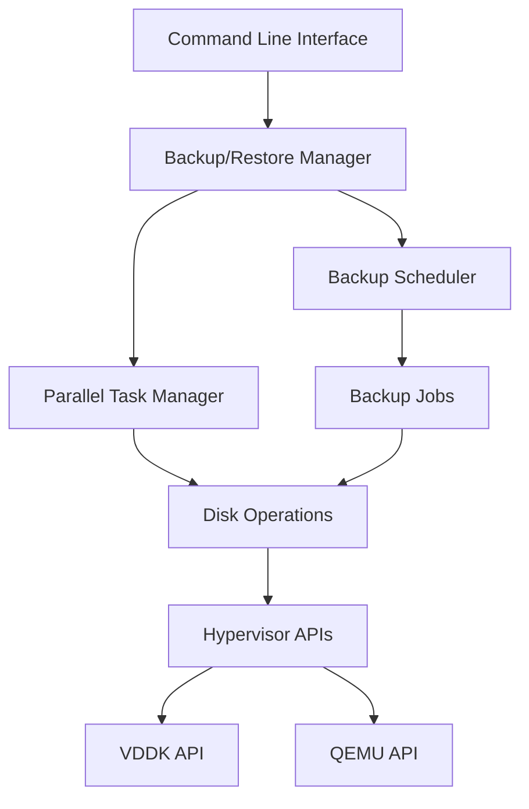
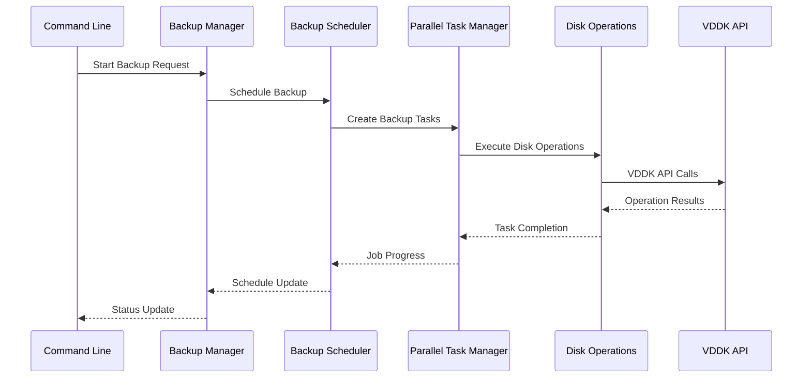
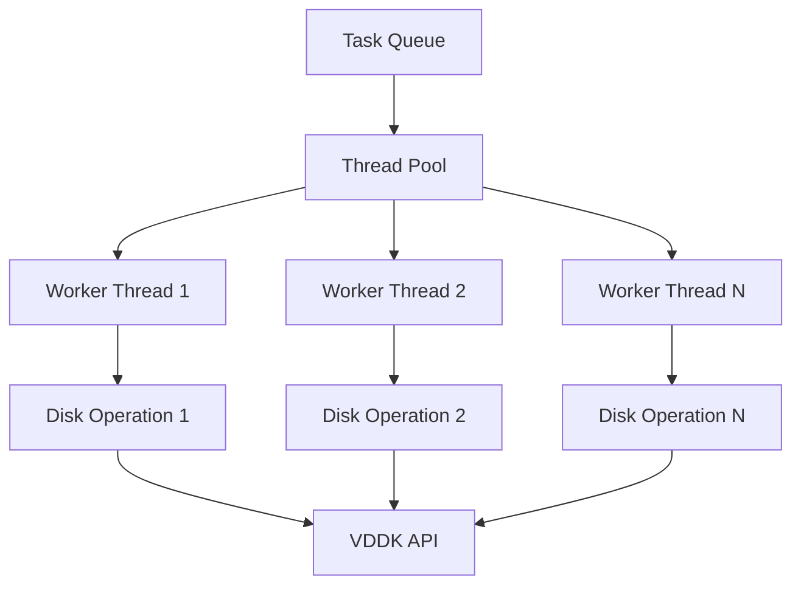
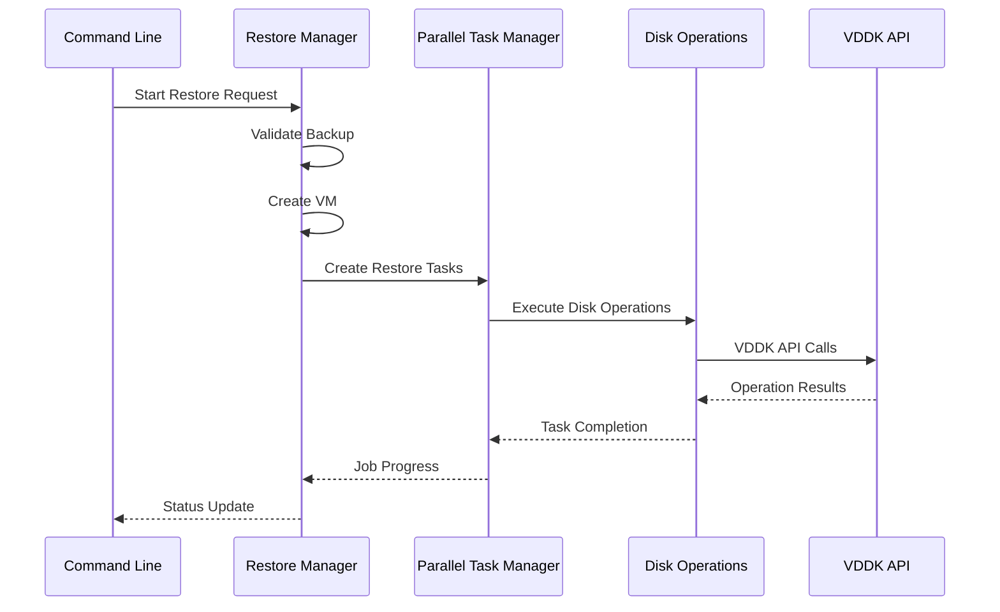
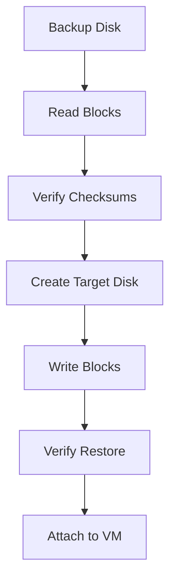
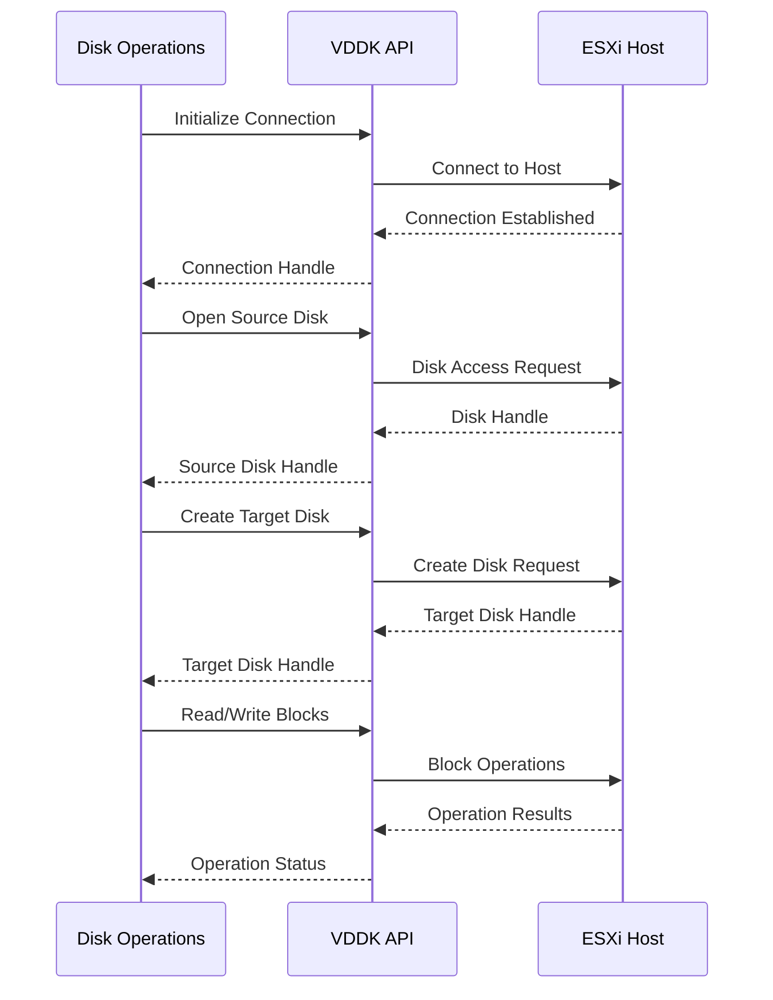
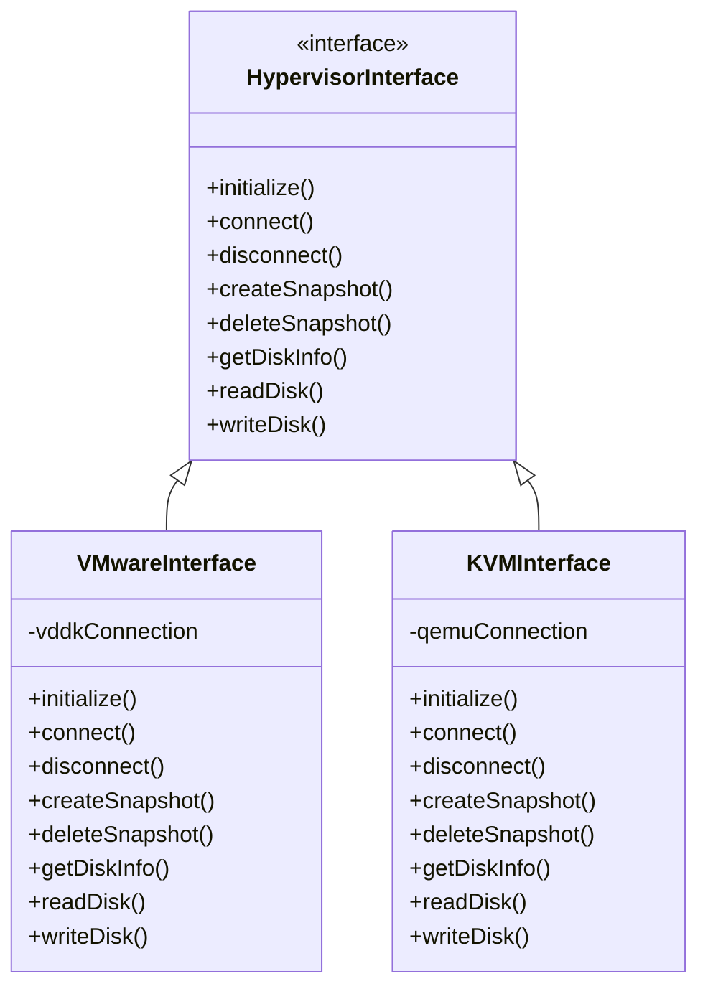
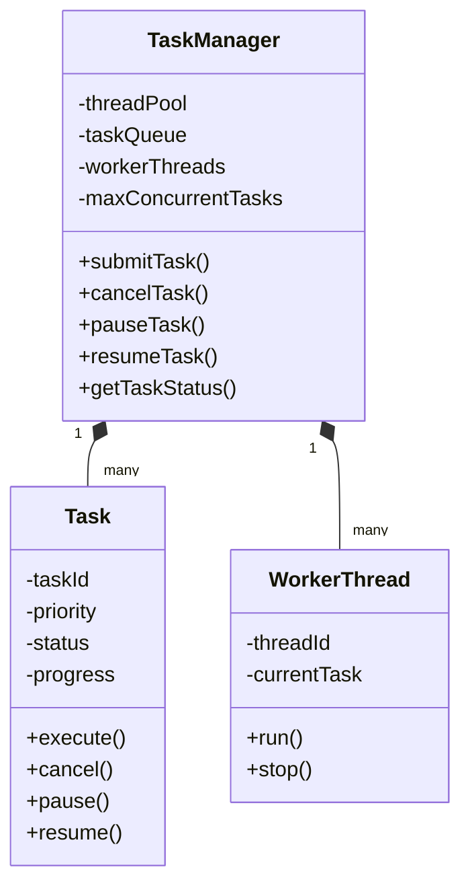

# GenieVM Backup/Restore System Design

## System Architecture

### High-Level Components



### Component Details

#### 1. Command Line Interface
- **Purpose**: User interaction and command processing
- **Key Features**:
  - Command parsing and validation
  - Configuration management
  - Progress reporting
  - Error handling

#### 2. Backup/Restore Manager
- **Purpose**: Central coordination of backup/restore operations
- **Key Features**:
  - Job scheduling and management
  - Parallel backup execution
  - Progress tracking
  - Error handling and recovery
- **Dependencies**:
  - Disk Backup
  - Logger
  - Common Utils

#### 3. Backup Scheduler
- **Purpose**: Manages scheduled backup operations
- **Key Features**:
  - Schedule management
  - Time-based execution
  - Retention policy enforcement
  - Schedule persistence
- **Dependencies**:
  - Backup Manager
  - Logger

#### 4. Parallel Task Manager
- **Purpose**: Handles concurrent disk operations
- **Key Features**:
  - Thread pool management
  - Task queuing
  - Resource allocation
  - Progress tracking
- **Dependencies**:
  - Disk Operations
  - Logger

#### 5. Disk Operations
- **Purpose**: Low-level disk manipulation
- **Key Features**:
  - VDDK integration
  - Block-level operations
  - Checksum verification
  - Error handling
- **Dependencies**:
  - VDDK API
  - Logger

#### 6. Hypervisor Interface Layer
- **Purpose**: Abstract hypervisor-specific operations
- **Key Features**:
  - Hypervisor detection and selection
  - API abstraction for different hypervisors
  - Common interface for disk operations
  - Platform-specific optimizations
- **Dependencies**:
  - VDDK API (VMware)
  - QEMU API (KVM)
  - Logger

## Backup Workflow

### 1. Command Line to Scheduler Flow



### 2. Parallel Task Management



## Restore Workflow

### 1. Command Line to Restore Flow



### 2. Disk Restore Process



## VDDK Integration

### 1. API Interaction Flow



## Key Design Decisions

### 1. Parallel Processing
- **Decision**: Implement parallel backup of multiple disks
- **Rationale**: Improves performance for VMs with multiple disks
- **Implementation**: Thread pool with configurable worker count

### 2. Incremental Backups
- **Decision**: Support for Changed Block Tracking (CBT)
- **Rationale**: Reduces backup time and storage requirements
- **Implementation**: VDDK CBT integration with block-level tracking

### 3. Error Handling
- **Decision**: Comprehensive error handling and recovery
- **Rationale**: Ensures system reliability and data integrity
- **Implementation**: Multi-level error handling with automatic retries

### 4. Progress Tracking
- **Decision**: Real-time progress monitoring
- **Rationale**: Provides user feedback and operation status
- **Implementation**: Callback-based progress reporting

## Configuration

### Backup Configuration
```json
{
    "vmId": "string",
    "sourcePath": "string",
    "backupPath": "string",
    "backupDir": "string",
    "scheduleType": "daily|weekly|monthly",
    "schedule": {
        "hour": 0,
        "minute": 0,
        "day": 1
    },
    "compressionLevel": 0,
    "maxConcurrentDisks": 1,
    "retentionDays": 7,
    "maxBackups": 10,
    "enableCBT": true,
    "incremental": false,
    "excludedDisks": []
}
```

### Restore Configuration
```json
{
    "vmId": "string",
    "backupId": "string",
    "vmName": "string",
    "targetDatastore": "string",
    "targetResourcePool": "string",
    "guestOS": "string",
    "numCPUs": 2,
    "memoryMB": 4096,
    "powerOnAfterRestore": false,
    "diskConfigs": [
        {
            "path": "string",
            "sizeKB": 0,
            "format": "string",
            "type": "string",
            "thinProvisioned": true
        }
    ]
}
```

### Hypervisor Configuration
```json
{
    "hypervisor": {
        "type": "vmware|kvm",
        "connection": {
            "host": "string",
            "username": "string",
            "password": "string",
            "port": 0,
            "ssl": true
        },
        "api": {
            "version": "string",
            "timeout": 0,
            "retryCount": 0
        }
    }
}
```

## Error Handling

### 1. Error Categories
- Connection errors
- Disk operation errors
- VDDK API errors
- Resource allocation errors
- Validation errors

### 2. Recovery Strategies
- Automatic retries for transient errors
- Fallback to full backup on incremental failure
- Cleanup of partial operations
- State recovery after interruption

## Performance Considerations

### 1. Resource Management
- Configurable thread pool size
- Memory usage optimization
- Disk I/O buffering
- Network bandwidth control

### 2. Optimization Techniques
- Parallel disk operations
- Incremental backup support
- Compression options
- Block-level operations

## Security

### 1. Authentication
- vSphere authentication
- API key management
- Secure credential storage

### 2. Data Protection
- Encrypted communication
- Secure storage of backup data
- Access control implementation 

## Multi-Hypervisor Support

### 1. Hypervisor Interface Design



### 2. Implementation Details

#### Base Interface
```cpp
class HypervisorInterface {
public:
    virtual ~HypervisorInterface() = default;
    
    // Connection management
    virtual bool initialize() = 0;
    virtual bool connect(const ConnectionParams& params) = 0;
    virtual void disconnect() = 0;
    
    // VM operations
    virtual bool createSnapshot(const std::string& vmId, 
                              const std::string& snapshotName) = 0;
    virtual bool deleteSnapshot(const std::string& vmId, 
                              const std::string& snapshotId) = 0;
    
    // Disk operations
    virtual DiskInfo getDiskInfo(const std::string& diskPath) = 0;
    virtual bool readDisk(const std::string& diskPath, 
                         uint64_t offset, 
                         uint32_t length, 
                         uint8_t* buffer) = 0;
    virtual bool writeDisk(const std::string& diskPath, 
                          uint64_t offset, 
                          uint32_t length, 
                          const uint8_t* buffer) = 0;
    
    // Platform-specific features
    virtual bool supportsCBT() const = 0;
    virtual bool enableCBT(const std::string& vmId) = 0;
    virtual std::vector<ChangedBlock> getChangedBlocks(
        const std::string& diskPath,
        const std::string& changeId) = 0;
};
```

#### VMware Implementation
```cpp
class VMwareInterface : public HypervisorInterface {
private:
    VixDiskLibConnection vddkConnection_;
    VixDiskLibHandle diskHandle_;
    
public:
    bool initialize() override {
        VixDiskLibInitParams initParams = {0};
        initParams.vmxSpec = nullptr;
        initParams.transportModes = VIXDISKLIB_TRANSPORT_NBD;
        
        VixError error = VixDiskLib_InitEx(
            VIXDISKLIB_VERSION_MAJOR,
            VIXDISKLIB_VERSION_MINOR,
            &initParams,
            nullptr,
            nullptr
        );
        
        return !VIX_FAILED(error);
    }
    
    bool connect(const ConnectionParams& params) override {
        VixDiskLibConnectParams connectParams = {0};
        connectParams.vmxSpec = params.host.c_str();
        connectParams.serverName = params.host.c_str();
        connectParams.credType = VIXDISKLIB_CRED_UID;
        connectParams.creds.uid.userName = params.username.c_str();
        connectParams.creds.uid.password = params.password.c_str();
        
        VixError error = VixDiskLib_ConnectEx(
            &connectParams,
            &vddkConnection_
        );
        
        return !VIX_FAILED(error);
    }
    
    bool readDisk(const std::string& diskPath,
                 uint64_t offset,
                 uint32_t length,
                 uint8_t* buffer) override {
        VixError error = VixDiskLib_Read(
            diskHandle_,
            offset / VIXDISKLIB_SECTOR_SIZE,
            length / VIXDISKLIB_SECTOR_SIZE,
            buffer
        );
        
        return !VIX_FAILED(error);
    }
    
    // ... other implementation methods ...
};
```

#### KVM Implementation
```cpp
class KVMInterface : public HypervisorInterface {
private:
    virConnectPtr connection_;
    virDomainPtr domain_;
    
public:
    bool initialize() override {
        // Initialize libvirt connection
        connection_ = virConnectOpen("qemu:///system");
        return connection_ != nullptr;
    }
    
    bool connect(const ConnectionParams& params) override {
        // Connect to QEMU/KVM host
        std::string uri = "qemu+ssh://" + params.username + "@" + 
                         params.host + "/system";
        connection_ = virConnectOpenAuth(
            uri.c_str(),
            virConnectAuthPtrDefault,
            0
        );
        return connection_ != nullptr;
    }
    
    bool readDisk(const std::string& diskPath,
                 uint64_t offset,
                 uint32_t length,
                 uint8_t* buffer) override {
        // Use QEMU block operations
        int fd = open(diskPath.c_str(), O_RDONLY);
        if (fd < 0) return false;
        
        lseek(fd, offset, SEEK_SET);
        ssize_t bytesRead = read(fd, buffer, length);
        close(fd);
        
        return bytesRead == length;
    }
    
    // ... other implementation methods ...
};
```

### 3. Factory Pattern for Hypervisor Selection

```cpp
class HypervisorFactory {
public:
    static std::unique_ptr<HypervisorInterface> createHypervisor(
        const std::string& type) {
        if (type == "vmware") {
            return std::make_unique<VMwareInterface>();
        } else if (type == "kvm") {
            return std::make_unique<KVMInterface>();
        }
        throw std::runtime_error("Unsupported hypervisor type: " + type);
    }
};
```

### 4. Platform-Specific Features

#### VMware Features
- Changed Block Tracking (CBT)
  - Block-level change tracking
  - Incremental backup support
  - Change ID management
- VDDK block-level operations
  - Direct disk access
  - Block-level read/write
  - Snapshot management
- vSphere API integration
  - VM management
  - Resource pool operations
  - Datastore operations
- Snapshot management
  - Quiesced snapshots
  - Memory snapshots
  - Snapshot chains

#### KVM Features
- QEMU block operations
  - QCOW2 format support
  - Block device operations
  - Snapshot management
- QCOW2 snapshot support
  - Internal snapshots
  - External snapshots
  - Snapshot chains
- Libvirt integration
  - Domain management
  - Storage pool operations
  - Network operations
- Block device management
  - Raw device support
  - QCOW2 device support
  - LVM device support

### 5. Configuration Management

```json
{
    "hypervisor": {
        "type": "vmware|kvm",
        "connection": {
            "host": "string",
            "username": "string",
            "password": "string",
            "port": 0,
            "ssl": true
        },
        "api": {
            "version": "string",
            "timeout": 0,
            "retryCount": 0
        },
        "features": {
            "enableCBT": true,
            "useSnapshots": true,
            "compression": {
                "enabled": true,
                "level": 6
            },
            "encryption": {
                "enabled": false,
                "algorithm": "aes-256-gcm"
            }
        },
        "storage": {
            "type": "local|nfs|s3",
            "path": "string",
            "credentials": {
                "accessKey": "string",
                "secretKey": "string"
            }
        }
    }
}
```

## Parallel Task Manager

### 1. Architecture



### 2. Implementation Details

#### Task Base Class
```cpp
class Task {
public:
    enum class Status {
        PENDING,
        RUNNING,
        PAUSED,
        COMPLETED,
        FAILED,
        CANCELLED
    };

    Task(const std::string& id, int priority = 0)
        : taskId_(id)
        , priority_(priority)
        , status_(Status::PENDING)
        , progress_(0.0)
        , cancelled_(false)
        , paused_(false) {}

    virtual ~Task() = default;

    virtual void execute() = 0;
    virtual void cancel() { cancelled_ = true; }
    virtual void pause() { paused_ = true; }
    virtual void resume() { paused_ = false; }

    const std::string& getId() const { return taskId_; }
    Status getStatus() const { return status_; }
    double getProgress() const { return progress_; }
    int getPriority() const { return priority_; }

protected:
    void updateProgress(double progress) {
        progress_ = progress;
        if (progressCallback_) {
            progressCallback_(progress);
        }
    }

    void setStatus(Status status) { status_ = status; }

    std::string taskId_;
    int priority_;
    Status status_;
    double progress_;
    std::atomic<bool> cancelled_;
    std::atomic<bool> paused_;
    std::function<void(double)> progressCallback_;
};
```

#### Disk Backup Task
```cpp
class DiskBackupTask : public Task {
public:
    DiskBackupTask(const std::string& id,
                  const std::string& diskPath,
                  const std::string& backupPath,
                  std::shared_ptr<HypervisorInterface> hypervisor)
        : Task(id)
        , diskPath_(diskPath)
        , backupPath_(backupPath)
        , hypervisor_(hypervisor) {}

    void execute() override {
        try {
            setStatus(Status::RUNNING);
            
            // Get disk info
            auto diskInfo = hypervisor_->getDiskInfo(diskPath_);
            uint64_t totalSectors = diskInfo.size / VIXDISKLIB_SECTOR_SIZE;
            
            // Create backup file
            if (!createBackupFile()) {
                throw std::runtime_error("Failed to create backup file");
            }
            
            // Read and write blocks
            const size_t bufferSize = 1024 * 1024; // 1MB
            std::vector<uint8_t> buffer(bufferSize);
            
            for (uint64_t sector = 0; sector < totalSectors; ) {
                if (cancelled_) {
                    setStatus(Status::CANCELLED);
                    return;
                }
                
                while (paused_) {
                    std::this_thread::sleep_for(std::chrono::milliseconds(100));
                }
                
                size_t sectorsToRead = std::min(
                    static_cast<uint64_t>(bufferSize / VIXDISKLIB_SECTOR_SIZE),
                    totalSectors - sector
                );
                
                if (!hypervisor_->readDisk(diskPath_,
                                         sector * VIXDISKLIB_SECTOR_SIZE,
                                         sectorsToRead * VIXDISKLIB_SECTOR_SIZE,
                                         buffer.data())) {
                    throw std::runtime_error("Failed to read disk");
                }
                
                if (!writeBackupData(sector, buffer.data(),
                                   sectorsToRead * VIXDISKLIB_SECTOR_SIZE)) {
                    throw std::runtime_error("Failed to write backup");
                }
                
                sector += sectorsToRead;
                updateProgress(static_cast<double>(sector) / totalSectors);
            }
            
            setStatus(Status::COMPLETED);
        } catch (const std::exception& e) {
            setStatus(Status::FAILED);
            errorMessage_ = e.what();
        }
    }

private:
    bool createBackupFile() {
        // Implementation for creating backup file
        return true;
    }
    
    bool writeBackupData(uint64_t offset, const uint8_t* data, size_t length) {
        // Implementation for writing backup data
        return true;
    }

    std::string diskPath_;
    std::string backupPath_;
    std::shared_ptr<HypervisorInterface> hypervisor_;
    std::string errorMessage_;
};
```

#### Task Manager Implementation
```cpp
class TaskManager {
public:
    TaskManager(size_t maxThreads = std::thread::hardware_concurrency())
        : maxThreads_(maxThreads)
        , running_(false) {
        start();
    }
    
    ~TaskManager() {
        stop();
    }
    
    void submitTask(std::shared_ptr<Task> task) {
        std::lock_guard<std::mutex> lock(queueMutex_);
        taskQueue_.push(task);
        queueCV_.notify_one();
    }
    
    void cancelTask(const std::string& taskId) {
        std::lock_guard<std::mutex> lock(queueMutex_);
        auto it = std::find_if(taskQueue_.begin(), taskQueue_.end(),
            [&](const auto& task) { return task->getId() == taskId; });
        if (it != taskQueue_.end()) {
            (*it)->cancel();
        }
    }
    
    void pauseTask(const std::string& taskId) {
        std::lock_guard<std::mutex> lock(queueMutex_);
        auto it = std::find_if(taskQueue_.begin(), taskQueue_.end(),
            [&](const auto& task) { return task->getId() == taskId; });
        if (it != taskQueue_.end()) {
            (*it)->pause();
        }
    }
    
    void resumeTask(const std::string& taskId) {
        std::lock_guard<std::mutex> lock(queueMutex_);
        auto it = std::find_if(taskQueue_.begin(), taskQueue_.end(),
            [&](const auto& task) { return task->getId() == taskId; });
        if (it != taskQueue_.end()) {
            (*it)->resume();
        }
    }
    
    Task::Status getTaskStatus(const std::string& taskId) const {
        std::lock_guard<std::mutex> lock(queueMutex_);
        auto it = std::find_if(taskQueue_.begin(), taskQueue_.end(),
            [&](const auto& task) { return task->getId() == taskId; });
        return it != taskQueue_.end() ? (*it)->getStatus() : Task::Status::PENDING;
    }

private:
    void start() {
        running_ = true;
        for (size_t i = 0; i < maxThreads_; ++i) {
            workers_.emplace_back(&TaskManager::workerThread, this);
        }
    }
    
    void stop() {
        running_ = false;
        queueCV_.notify_all();
        for (auto& worker : workers_) {
            if (worker.joinable()) {
                worker.join();
            }
        }
    }
    
    void workerThread() {
        while (running_) {
            std::shared_ptr<Task> task;
            {
                std::unique_lock<std::mutex> lock(queueMutex_);
                queueCV_.wait(lock, [this] {
                    return !running_ || !taskQueue_.empty();
                });
                
                if (!running_) {
                    break;
                }
                
                if (!taskQueue_.empty()) {
                    task = taskQueue_.top();
                    taskQueue_.pop();
                }
            }
            
            if (task) {
                task->execute();
            }
        }
    }

    size_t maxThreads_;
    std::atomic<bool> running_;
    std::vector<std::thread> workers_;
    std::priority_queue<std::shared_ptr<Task>> taskQueue_;
    mutable std::mutex queueMutex_;
    std::condition_variable queueCV_;
};
```

### 3. Resource Management

#### Memory Pool
```cpp
class MemoryPool {
public:
    MemoryPool(size_t blockSize, size_t numBlocks)
        : blockSize_(blockSize)
        , numBlocks_(numBlocks) {
        for (size_t i = 0; i < numBlocks; ++i) {
            freeBlocks_.push(std::make_unique<uint8_t[]>(blockSize));
        }
    }
    
    std::unique_ptr<uint8_t[]> allocate() {
        std::lock_guard<std::mutex> lock(mutex_);
        if (freeBlocks_.empty()) {
            return nullptr;
        }
        auto block = std::move(freeBlocks_.top());
        freeBlocks_.pop();
        return block;
    }
    
    void deallocate(std::unique_ptr<uint8_t[]> block) {
        std::lock_guard<std::mutex> lock(mutex_);
        freeBlocks_.push(std::move(block));
    }

private:
    size_t blockSize_;
    size_t numBlocks_;
    std::stack<std::unique_ptr<uint8_t[]>> freeBlocks_;
    std::mutex mutex_;
};
```

#### Connection Pool
```cpp
class ConnectionPool {
public:
    ConnectionPool(size_t maxConnections)
        : maxConnections_(maxConnections) {}
    
    std::shared_ptr<HypervisorInterface> acquire() {
        std::lock_guard<std::mutex> lock(mutex_);
        if (freeConnections_.empty() && connections_.size() < maxConnections_) {
            auto conn = createConnection();
            connections_.push_back(conn);
            return conn;
        }
        
        if (freeConnections_.empty()) {
            return nullptr;
        }
        
        auto conn = freeConnections_.top();
        freeConnections_.pop();
        return conn;
    }
    
    void release(std::shared_ptr<HypervisorInterface> conn) {
        std::lock_guard<std::mutex> lock(mutex_);
        freeConnections_.push(conn);
    }

private:
    std::shared_ptr<HypervisorInterface> createConnection() {
        // Implementation for creating new connection
        return nullptr;
    }

    size_t maxConnections_;
    std::vector<std::shared_ptr<HypervisorInterface>> connections_;
    std::stack<std::shared_ptr<HypervisorInterface>> freeConnections_;
    std::mutex mutex_;
};
```

## VDDK API Integration

### 1. Core VDDK Functions

#### Connection Management
```cpp
// Initialize VDDK
VixError VixDiskLib_InitEx(
    uint32_t majorVersion,
    uint32_t minorVersion,
    VixDiskLibInitParams* initParams,
    VixDiskLibLogFunc* logFunc,
    void* logData
);

// Connect to ESX host
VixError VixDiskLib_ConnectEx(
    const VixDiskLibConnectParams* connectParams,
    VixDiskLibConnection* connection
);
```

#### Disk Operations
```cpp
// Open disk
VixError VixDiskLib_Open(
    VixDiskLibConnection connection,
    const char* path,
    uint32_t flags,
    VixDiskLibHandle* handle
);

// Read blocks
VixError VixDiskLib_Read(
    VixDiskLibHandle handle,
    VixDiskLibSectorType startSector,
    VixDiskLibSectorType numSectors,
    uint8_t* buffer
);

// Write blocks
VixError VixDiskLib_Write(
    VixDiskLibHandle handle,
    VixDiskLibSectorType startSector,
    VixDiskLibSectorType numSectors,
    const uint8_t* buffer
);
```

#### Changed Block Tracking
```cpp
// Enable CBT
VixError VixDiskLib_EnableChangeTracking(
    VixDiskLibHandle handle,
    const char* changeId,
    VixDiskLibChangeTrackingMode mode
);

// Query changed blocks
VixError VixDiskLib_QueryChangedDiskAreas(
    VixDiskLibHandle handle,
    const char* changeId,
    VixDiskLibSectorType startSector,
    VixDiskLibSectorType numSectors,
    VixDiskLibBlockList** blockList
);
```

### 2. VDDK Wrapper Implementation

#### VDDK Connection Manager
```cpp
class VDDKConnectionManager {
public:
    VDDKConnectionManager() : initialized_(false) {}
    
    bool initialize() {
        if (initialized_) return true;
        
        VixDiskLibInitParams initParams = {0};
        initParams.vmxSpec = nullptr;
        initParams.transportModes = VIXDISKLIB_TRANSPORT_NBD;
        
        VixError error = VixDiskLib_InitEx(
            VIXDISKLIB_VERSION_MAJOR,
            VIXDISKLIB_VERSION_MINOR,
            &initParams,
            logFunc,
            this
        );
        
        if (VIX_FAILED(error)) {
            logError("Failed to initialize VDDK", error);
            return false;
        }
        
        initialized_ = true;
        return true;
    }
    
    bool connect(const std::string& host,
                const std::string& username,
                const std::string& password) {
        if (!initialized_) {
            if (!initialize()) return false;
        }
        
        VixDiskLibConnectParams connectParams = {0};
        connectParams.vmxSpec = host.c_str();
        connectParams.serverName = host.c_str();
        connectParams.credType = VIXDISKLIB_CRED_UID;
        connectParams.creds.uid.userName = username.c_str();
        connectParams.creds.uid.password = password.c_str();
        
        VixError error = VixDiskLib_ConnectEx(
            &connectParams,
            &connection_
        );
        
        if (VIX_FAILED(error)) {
            logError("Failed to connect to host", error);
            return false;
        }
        
        return true;
    }
    
    void disconnect() {
        if (connection_) {
            VixDiskLib_Disconnect(connection_);
            connection_ = nullptr;
        }
        
        if (initialized_) {
            VixDiskLib_Exit();
            initialized_ = false;
        }
    }
    
    ~VDDKConnectionManager() {
        disconnect();
    }

private:
    static void logFunc(const char* fmt, va_list args) {
        char buffer[1024];
        vsnprintf(buffer, sizeof(buffer), fmt, args);
        Logger::debug("VDDK: " + std::string(buffer));
    }
    
    void logError(const std::string& message, VixError error) {
        char* errorText = Vix_GetErrorText(error, nullptr);
        Logger::error(message + ": " + std::string(errorText));
        Vix_FreeErrorText(errorText);
    }

    bool initialized_;
    VixDiskLibConnection connection_;
};
```

#### VDDK Disk Manager
```cpp
class VDDKDiskManager {
public:
    VDDKDiskManager(std::shared_ptr<VDDKConnectionManager> connManager)
        : connManager_(connManager) {}
    
    bool openDisk(const std::string& path, uint32_t flags = 0) {
        VixError error = VixDiskLib_Open(
            connManager_->getConnection(),
            path.c_str(),
            flags,
            &handle_
        );
        
        if (VIX_FAILED(error)) {
            logError("Failed to open disk", error);
            return false;
        }
        
        return true;
    }
    
    bool readBlocks(uint64_t startSector,
                   uint32_t numSectors,
                   uint8_t* buffer) {
        VixError error = VixDiskLib_Read(
            handle_,
            startSector,
            numSectors,
            buffer
        );
        
        if (VIX_FAILED(error)) {
            logError("Failed to read blocks", error);
            return false;
        }
        
        return true;
    }
    
    bool writeBlocks(uint64_t startSector,
                    uint32_t numSectors,
                    const uint8_t* buffer) {
        VixError error = VixDiskLib_Write(
            handle_,
            startSector,
            numSectors,
            buffer
        );
        
        if (VIX_FAILED(error)) {
            logError("Failed to write blocks", error);
            return false;
        }
        
        return true;
    }
    
    bool enableCBT(const std::string& changeId) {
        VixError error = VixDiskLib_EnableChangeTracking(
            handle_,
            changeId.c_str(),
            VIXDISKLIB_CHANGETRACKING_MODE_BLOCK
        );
        
        if (VIX_FAILED(error)) {
            logError("Failed to enable CBT", error);
            return false;
        }
        
        return true;
    }
    
    std::vector<ChangedBlock> getChangedBlocks(
        const std::string& changeId,
        uint64_t startSector,
        uint32_t numSectors) {
        VixDiskLibBlockList* blockList = nullptr;
        VixError error = VixDiskLib_QueryChangedDiskAreas(
            handle_,
            changeId.c_str(),
            startSector,
            numSectors,
            &blockList
        );
        
        if (VIX_FAILED(error)) {
            logError("Failed to query changed blocks", error);
            return {};
        }
        
        std::vector<ChangedBlock> changedBlocks;
        for (uint32_t i = 0; i < blockList->numBlocks; ++i) {
            ChangedBlock block;
            block.startSector = blockList->blocks[i].offset;
            block.numSectors = blockList->blocks[i].length;
            changedBlocks.push_back(block);
        }
        
        VixDiskLib_FreeBlockList(blockList);
        return changedBlocks;
    }
    
    void closeDisk() {
        if (handle_) {
            VixDiskLib_Close(handle_);
            handle_ = nullptr;
        }
    }
    
    ~VDDKDiskManager() {
        closeDisk();
    }

private:
    void logError(const std::string& message, VixError error) {
        char* errorText = Vix_GetErrorText(error, nullptr);
        Logger::error(message + ": " + std::string(errorText));
        Vix_FreeErrorText(errorText);
    }

    std::shared_ptr<VDDKConnectionManager> connManager_;
    VixDiskLibHandle handle_;
};
```

### 3. Performance Optimization

#### Buffer Management
```cpp
class DiskBuffer {
private:
    static const size_t BUFFER_SIZE = 1024 * 1024; // 1MB
    std::vector<uint8_t> buffer;
    
public:
    DiskBuffer() : buffer(BUFFER_SIZE) {}
    uint8_t* data() { return buffer.data(); }
    size_t size() const { return buffer.size(); }
};
```

#### Parallel Block Operations
```cpp
class BlockOperation {
private:
    VixDiskLibHandle handle;
    uint64_t startSector;
    uint32_t numSectors;
    std::function<void(uint8_t*)> operation;
    
public:
    void execute() {
        DiskBuffer buffer;
        VixError error = VixDiskLib_Read(
            handle,
            startSector,
            numSectors,
            buffer.data()
        );
        if (VIX_FAILED(error)) {
            throw VDDKError(error);
        }
        operation(buffer.data());
    }
};
```

### 4. Error Handling

```cpp
class VDDKError : public std::runtime_error {
public:
    VDDKError(VixError error) 
        : std::runtime_error(Vix_GetErrorText(error, nullptr)) {
        errorCode_ = error;
    }
    
    VixError getErrorCode() const { return errorCode_; }
    
private:
    VixError errorCode_;
};
```

### 5. Usage Example

```cpp
class VDDKBackup {
public:
    VDDKBackup(const std::string& host,
               const std::string& username,
               const std::string& password)
        : connManager_(std::make_shared<VDDKConnectionManager>())
        , diskManager_(connManager_) {
        if (!connManager_->connect(host, username, password)) {
            throw std::runtime_error("Failed to connect to host");
        }
    }
    
    bool backupDisk(const std::string& sourcePath,
                   const std::string& targetPath,
                   bool incremental = false) {
        // Open source disk
        if (!diskManager_.openDisk(sourcePath)) {
            return false;
        }
        
        // Get disk info
        VixDiskLibInfo* diskInfo = nullptr;
        VixError error = VixDiskLib_GetInfo(diskManager_.getHandle(), &diskInfo);
        if (VIX_FAILED(error)) {
            return false;
        }
        
        // Create target disk
        VixDiskLibCreateParams createParams = {0};
        createParams.adapterType = VIXDISKLIB_ADAPTER_IDE;
        createParams.diskType = VIXDISKLIB_DISK_MONOLITHIC_FLAT;
        
        error = VixDiskLib_Create(
            connManager_->getConnection(),
            targetPath.c_str(),
            &createParams,
            nullptr,
            nullptr
        );
        
        if (VIX_FAILED(error)) {
            VixDiskLib_FreeInfo(diskInfo);
            return false;
        }
        
        // Perform backup
        const size_t bufferSize = 1024 * 1024; // 1MB
        std::vector<uint8_t> buffer(bufferSize);
        
        for (uint64_t sector = 0; sector < diskInfo->capacity; ) {
            size_t sectorsToRead = std::min(
                static_cast<uint64_t>(bufferSize / VIXDISKLIB_SECTOR_SIZE),
                diskInfo->capacity - sector
            );
            
            if (!diskManager_.readBlocks(sector, sectorsToRead, buffer.data())) {
                VixDiskLib_FreeInfo(diskInfo);
                return false;
            }
            
            // Write to target disk
            // ... implementation ...
            
            sector += sectorsToRead;
        }
        
        VixDiskLib_FreeInfo(diskInfo);
        return true;
    }

private:
    std::shared_ptr<VDDKConnectionManager> connManager_;
    VDDKDiskManager diskManager_;
}; 
```

## Advanced VDDK Features

### 1. Snapshot Management

#### Snapshot Operations
```cpp
class VDDKSnapshotManager {
public:
    bool createSnapshot(const std::string& vmId,
                       const std::string& snapshotName,
                       bool quiesce = true) {
        VixError error = VixVM_CreateSnapshot(
            vmHandle_,
            snapshotName.c_str(),
            quiesce ? VIX_SNAPSHOT_INCLUDE_MEMORY : 0,
            nullptr,
            nullptr
        );
        
        if (VIX_FAILED(error)) {
            logError("Failed to create snapshot", error);
            return false;
        }
        
        return true;
    }
    
    bool deleteSnapshot(const std::string& snapshotId) {
        VixError error = VixVM_RemoveSnapshot(
            vmHandle_,
            snapshotId.c_str(),
            VIX_SNAPSHOT_REMOVE_CHILDREN,
            nullptr,
            nullptr
        );
        
        if (VIX_FAILED(error)) {
            logError("Failed to delete snapshot", error);
            return false;
        }
        
        return true;
    }
    
    std::vector<SnapshotInfo> listSnapshots() {
        VixHandle snapshotList = nullptr;
        VixError error = VixVM_GetNumSnapshots(vmHandle_, &snapshotList);
        if (VIX_FAILED(error)) {
            logError("Failed to get snapshot list", error);
            return {};
        }
        
        std::vector<SnapshotInfo> snapshots;
        int numSnapshots = 0;
        VixVM_GetNumSnapshots(vmHandle_, &numSnapshots);
        
        for (int i = 0; i < numSnapshots; ++i) {
            VixHandle snapshot = nullptr;
            error = VixVM_GetSnapshotByIndex(vmHandle_, i, &snapshot);
            if (VIX_FAILED(error)) continue;
            
            SnapshotInfo info;
            char* name = nullptr;
            VixVM_GetSnapshotName(snapshot, &name);
            info.name = name;
            Vix_FreeBuffer(name);
            
            snapshots.push_back(info);
            Vix_ReleaseHandle(snapshot);
        }
        
        return snapshots;
    }

private:
    VixHandle vmHandle_;
};
```

### 2. Advanced CBT Features

#### CBT Manager
```cpp
class CBTManager {
public:
    struct CBTConfig {
        bool enableCompression;
        bool enableEncryption;
        std::string compressionLevel;
        std::string encryptionKey;
    };
    
    bool configureCBT(const CBTConfig& config) {
        // Set CBT configuration
        VixDiskLibChangeTrackingConfig cbtConfig = {0};
        cbtConfig.enableCompression = config.enableCompression;
        cbtConfig.enableEncryption = config.enableEncryption;
        
        VixError error = VixDiskLib_SetChangeTrackingConfig(
            handle_,
            &cbtConfig
        );
        
        if (VIX_FAILED(error)) {
            logError("Failed to configure CBT", error);
            return false;
        }
        
        return true;
    }
    
    std::vector<ChangedBlock> getChangedBlocksWithMetadata(
        const std::string& changeId,
        uint64_t startSector,
        uint32_t numSectors) {
        VixDiskLibBlockList* blockList = nullptr;
        VixDiskLibBlockMetadata* metadata = nullptr;
        
        VixError error = VixDiskLib_QueryChangedDiskAreasEx(
            handle_,
            changeId.c_str(),
            startSector,
            numSectors,
            &blockList,
            &metadata
        );
        
        if (VIX_FAILED(error)) {
            logError("Failed to query changed blocks with metadata", error);
            return {};
        }
        
        std::vector<ChangedBlock> changedBlocks;
        for (uint32_t i = 0; i < blockList->numBlocks; ++i) {
            ChangedBlock block;
            block.startSector = blockList->blocks[i].offset;
            block.numSectors = blockList->blocks[i].length;
            block.metadata = metadata[i];
            changedBlocks.push_back(block);
        }
        
        VixDiskLib_FreeBlockList(blockList);
        VixDiskLib_FreeBlockMetadata(metadata);
        return changedBlocks;
    }
    
    bool mergeCBTData(const std::string& sourceChangeId,
                     const std::string& targetChangeId) {
        VixError error = VixDiskLib_MergeChangeTracking(
            handle_,
            sourceChangeId.c_str(),
            targetChangeId.c_str()
        );
        
        if (VIX_FAILED(error)) {
            logError("Failed to merge CBT data", error);
            return false;
        }
        
        return true;
    }

private:
    VixDiskLibHandle handle_;
};
```

### 3. Performance Optimizations

#### Advanced Buffer Management
```cpp
class AdvancedDiskBuffer {
public:
    struct BufferConfig {
        size_t bufferSize;
        size_t alignment;
        bool useDirectIO;
        bool useCompression;
    };
    
    AdvancedDiskBuffer(const BufferConfig& config)
        : config_(config)
        , buffer_(nullptr) {
        allocateBuffer();
    }
    
    ~AdvancedDiskBuffer() {
        deallocateBuffer();
    }
    
    bool readWithOptimization(VixDiskLibHandle handle,
                            uint64_t startSector,
                            uint32_t numSectors) {
        if (config_.useDirectIO) {
            return readDirectIO(handle, startSector, numSectors);
        } else {
            return readBuffered(handle, startSector, numSectors);
        }
    }
    
    bool writeWithOptimization(VixDiskLibHandle handle,
                             uint64_t startSector,
                             uint32_t numSectors) {
        if (config_.useDirectIO) {
            return writeDirectIO(handle, startSector, numSectors);
        } else {
            return writeBuffered(handle, startSector, numSectors);
        }
    }

private:
    void allocateBuffer() {
        if (config_.alignment > 0) {
            buffer_ = static_cast<uint8_t*>(
                aligned_alloc(config_.alignment, config_.bufferSize)
            );
        } else {
            buffer_ = new uint8_t[config_.bufferSize];
        }
    }
    
    void deallocateBuffer() {
        if (config_.alignment > 0) {
            free(buffer_);
        } else {
            delete[] buffer_;
        }
        buffer_ = nullptr;
    }
    
    bool readDirectIO(VixDiskLibHandle handle,
                     uint64_t startSector,
                     uint32_t numSectors) {
        // Implementation for direct I/O read
        return true;
    }
    
    bool writeDirectIO(VixDiskLibHandle handle,
                      uint64_t startSector,
                      uint32_t numSectors) {
        // Implementation for direct I/O write
        return true;
    }
    
    bool readBuffered(VixDiskLibHandle handle,
                     uint64_t startSector,
                     uint32_t numSectors) {
        // Implementation for buffered read
        return true;
    }
    
    bool writeBuffered(VixDiskLibHandle handle,
                      uint64_t startSector,
                      uint32_t numSectors) {
        // Implementation for buffered write
        return true;
    }

    BufferConfig config_;
    uint8_t* buffer_;
};
```

#### Parallel Processing Optimizations
```cpp
class ParallelDiskOperation {
public:
    struct OperationConfig {
        size_t numThreads;
        size_t chunkSize;
        bool useCompression;
        bool useEncryption;
    };
    
    ParallelDiskOperation(const OperationConfig& config)
        : config_(config)
        , threadPool_(config.numThreads) {}
    
    bool executeParallel(const std::string& sourcePath,
                        const std::string& targetPath) {
        // Get disk info
        VixDiskLibInfo* diskInfo = nullptr;
        VixError error = VixDiskLib_GetInfo(sourceHandle_, &diskInfo);
        if (VIX_FAILED(error)) {
            return false;
        }
        
        // Calculate chunks
        uint64_t totalSectors = diskInfo->capacity;
        size_t numChunks = (totalSectors + config_.chunkSize - 1) / 
                          config_.chunkSize;
        
        // Create tasks
        std::vector<std::future<bool>> tasks;
        for (size_t i = 0; i < numChunks; ++i) {
            uint64_t startSector = i * config_.chunkSize;
            uint32_t sectorsToProcess = std::min(
                static_cast<uint64_t>(config_.chunkSize),
                totalSectors - startSector
            );
            
            tasks.push_back(threadPool_.submit([=]() {
                return processChunk(startSector, sectorsToProcess);
            }));
        }
        
        // Wait for completion
        bool success = true;
        for (auto& task : tasks) {
            if (!task.get()) {
                success = false;
                break;
            }
        }
        
        VixDiskLib_FreeInfo(diskInfo);
        return success;
    }

private:
    bool processChunk(uint64_t startSector, uint32_t numSectors) {
        AdvancedDiskBuffer buffer({
            config_.chunkSize * VIXDISKLIB_SECTOR_SIZE,
            4096,  // 4KB alignment
            true,  // Use direct I/O
            config_.useCompression
        });
        
        if (!buffer.readWithOptimization(sourceHandle_,
                                       startSector,
                                       numSectors)) {
            return false;
        }
        
        if (config_.useCompression) {
            // Compress data
        }
        
        if (config_.useEncryption) {
            // Encrypt data
        }
        
        return buffer.writeWithOptimization(targetHandle_,
                                          startSector,
                                          numSectors);
    }

    OperationConfig config_;
    ThreadPool threadPool_;
    VixDiskLibHandle sourceHandle_;
    VixDiskLibHandle targetHandle_;
};
```

### 4. Error Recovery

#### Advanced Error Handling
```cpp
class VDDKErrorRecovery {
public:
    struct RecoveryConfig {
        int maxRetries;
        int retryDelay;
        bool useExponentialBackoff;
        std::vector<VixError> retryableErrors;
    };
    
    bool handleError(VixError error,
                    const std::string& operation,
                    const RecoveryConfig& config) {
        if (std::find(config.retryableErrors.begin(),
                     config.retryableErrors.end(),
                     error) == config.retryableErrors.end()) {
            return false;
        }
        
        int retryCount = 0;
        int delay = config.retryDelay;
        
        while (retryCount < config.maxRetries) {
            std::this_thread::sleep_for(
                std::chrono::milliseconds(delay)
            );
            
            if (retryOperation()) {
                return true;
            }
            
            retryCount++;
            if (config.useExponentialBackoff) {
                delay *= 2;
            }
        }
        
        return false;
    }
    
    bool recoverFromSnapshot(const std::string& snapshotId) {
        // Implementation for snapshot recovery
        return true;
    }
    
    bool recoverFromCheckpoint(const std::string& checkpointId) {
        // Implementation for checkpoint recovery
        return true;
    }

private:
    bool retryOperation() {
        // Implementation for operation retry
        return true;
    }
};
```

## VDDK Transport Mode Implementation Details

### 1. Transport Mode Initialization

```cpp
class VDDKTransportInitializer {
public:
    struct TransportOptions {
        bool useSSL;
        int port;
        std::string thumbPrint;
        size_t bufferSize;
        int timeout;
    };
    
    bool initializeNBD(const TransportOptions& options) {
        VixDiskLibInitParams initParams = {0};
        initParams.vmxSpec = nullptr;
        initParams.transportModes = VIXDISKLIB_TRANSPORT_NBD;
        
        // Configure SSL if enabled
        if (options.useSSL) {
            initParams.sslThumbPrint = options.thumbPrint.c_str();
            initParams.port = options.port;
        }
        
        // Set buffer size and timeout
        initParams.bufferSize = options.bufferSize;
        initParams.timeout = options.timeout;
        
        VixError error = VixDiskLib_InitEx(
            VIXDISKLIB_VERSION_MAJOR,
            VIXDISKLIB_VERSION_MINOR,
            &initParams,
            logFunc,
            this
        );
        
        return !VIX_FAILED(error);
    }
    
    bool initializeHotAdd(const std::string& proxyVmName,
                         const TransportOptions& options) {
        VixDiskLibInitParams initParams = {0};
        initParams.vmxSpec = proxyVmName.c_str();
        initParams.transportModes = VIXDISKLIB_TRANSPORT_HOTADD;
        
        // HotAdd specific configurations
        initParams.bufferSize = options.bufferSize;
        initParams.timeout = options.timeout;
        
        VixError error = VixDiskLib_InitEx(
            VIXDISKLIB_VERSION_MAJOR,
            VIXDISKLIB_VERSION_MINOR,
            &initParams,
            logFunc,
            this
        );
        
        return !VIX_FAILED(error);
    }
    
    bool initializeSAN(const std::string& sanConfig,
                      const TransportOptions& options) {
        VixDiskLibInitParams initParams = {0};
        initParams.vmxSpec = nullptr;
        initParams.transportModes = VIXDISKLIB_TRANSPORT_SAN;
        initParams.sanConfig = sanConfig.c_str();
        
        // SAN specific configurations
        initParams.bufferSize = options.bufferSize;
        initParams.timeout = options.timeout;
        
        VixError error = VixDiskLib_InitEx(
            VIXDISKLIB_VERSION_MAJOR,
            VIXDISKLIB_VERSION_MINOR,
            &initParams,
            logFunc,
            this
        );
        
        return !VIX_FAILED(error);
    }
};
```

### 2. Connection Management

```cpp
class VDDKConnectionManager {
public:
    struct ConnectionConfig {
        std::string host;
        std::string username;
        std::string password;
        bool useSSL;
        int port;
        std::string thumbPrint;
    };
    
    bool connectNBD(const ConnectionConfig& config) {
        VixDiskLibConnectParams connectParams = {0};
        connectParams.vmxSpec = config.host.c_str();
        connectParams.serverName = config.host.c_str();
        connectParams.credType = VIXDISKLIB_CRED_UID;
        connectParams.creds.uid.userName = config.username.c_str();
        connectParams.creds.uid.password = config.password.c_str();
        
        if (config.useSSL) {
            connectParams.port = config.port;
            connectParams.thumbPrint = config.thumbPrint.c_str();
        }
        
        VixError error = VixDiskLib_ConnectEx(
            &connectParams,
            &connection_
        );
        
        return !VIX_FAILED(error);
    }
    
    bool connectHotAdd(const std::string& proxyVmName,
                      const ConnectionConfig& config) {
        // HotAdd requires proxy VM connection
        VixHandle hostHandle = nullptr;
        VixError error = VixHost_Connect(
            VIX_API_VERSION,
            VIX_SERVICEPROVIDER_VMWARE_SERVER,
            config.host.c_str(),
            config.port,
            config.username.c_str(),
            config.password.c_str(),
            0,
            VIX_INVALID_HANDLE,
            &hostHandle,
            nullptr
        );
        
        if (VIX_FAILED(error)) {
            return false;
        }
        
        // Open the proxy VM
        error = VixHost_OpenVM(
            hostHandle,
            proxyVmName.c_str(),
            VIX_VMOPEN_NORMAL,
            VIX_INVALID_HANDLE,
            &vmHandle_,
            nullptr
        );
        
        Vix_ReleaseHandle(hostHandle);
        return !VIX_FAILED(error);
    }
    
    bool connectSAN(const std::string& sanConfig,
                   const ConnectionConfig& config) {
        // SAN connection requires specific storage configuration
        VixDiskLibConnectParams connectParams = {0};
        connectParams.vmxSpec = nullptr;
        connectParams.serverName = config.host.c_str();
        connectParams.sanConfig = sanConfig.c_str();
        
        VixError error = VixDiskLib_ConnectEx(
            &connectParams,
            &connection_
        );
        
        return !VIX_FAILED(error);
    }
    
    void disconnect() {
        if (connection_) {
            VixDiskLib_Disconnect(connection_);
            connection_ = nullptr;
        }
        if (vmHandle_) {
            Vix_ReleaseHandle(vmHandle_);
            vmHandle_ = nullptr;
        }
    }

private:
    VixDiskLibConnection connection_;
    VixHandle vmHandle_;
};
```

### 3. Transport Mode Selection and Validation

```cpp
class TransportModeValidator {
public:
    struct EnvironmentInfo {
        bool isProxyVM;
        bool sameVCenter;
        bool hasSanAccess;
        std::string proxyVmName;
        std::string sanConfig;
        int networkBandwidth;
        int storageBandwidth;
    };
    
    static TransportMode selectOptimalMode(const EnvironmentInfo& env) {
        // Check environment capabilities
        if (env.isProxyVM && env.sameVCenter) {
            // HotAdd is optimal for same vCenter operations
            return TransportMode::HOTADD;
        }
        
        if (env.hasSanAccess && env.storageBandwidth > env.networkBandwidth) {
            // SAN is optimal for high-speed storage access
            return TransportMode::SAN;
        }
        
        // NBD is the default fallback
        return TransportMode::NBD;
    }
    
    static bool validateMode(const TransportMode& mode,
                           const EnvironmentInfo& env) {
        switch (mode) {
            case TransportMode::HOTADD:
                return validateHotAdd(env);
            case TransportMode::SAN:
                return validateSAN(env);
            case TransportMode::NBD:
                return validateNBD(env);
            default:
                return false;
        }
    }
    
private:
    static bool validateHotAdd(const EnvironmentInfo& env) {
        return env.isProxyVM && 
               env.sameVCenter && 
               !env.proxyVmName.empty();
    }
    
    static bool validateSAN(const EnvironmentInfo& env) {
        return env.hasSanAccess && 
               !env.sanConfig.empty() && 
               env.storageBandwidth > 0;
    }
    
    static bool validateNBD(const EnvironmentInfo& env) {
        return env.networkBandwidth > 0;
    }
};
```

### 4. Performance Optimization

```cpp
class TransportOptimizer {
public:
    struct OptimizationConfig {
        size_t bufferSize;
        int numThreads;
        bool useCompression;
        int compressionLevel;
        bool useSSL;
    };
    
    static OptimizationConfig getOptimalConfig(
        const TransportMode& mode,
        const EnvironmentInfo& env) {
        OptimizationConfig config;
        
        switch (mode) {
            case TransportMode::HOTADD:
                // HotAdd can use larger buffers due to direct access
                config.bufferSize = 4 * 1024 * 1024;  // 4MB
                config.numThreads = std::thread::hardware_concurrency();
                config.useCompression = false;  // No need for compression
                break;
                
            case TransportMode::SAN:
                // SAN can also use larger buffers
                config.bufferSize = 4 * 1024 * 1024;  // 4MB
                config.numThreads = std::thread::hardware_concurrency();
                config.useCompression = false;
                break;
                
            case TransportMode::NBD:
                // NBD needs smaller buffers and compression
                config.bufferSize = 1 * 1024 * 1024;  // 1MB
                config.numThreads = std::min(
                    std::thread::hardware_concurrency(),
                    static_cast<unsigned int>(4)
                );
                config.useCompression = true;
                config.compressionLevel = 6;  // Balanced compression
                break;
        }
        
        // SSL is always enabled for security
        config.useSSL = true;
        
        return config;
    }
};
```

### 5. Error Handling and Recovery

```cpp
class TransportErrorHandler {
public:
    struct ErrorConfig {
        int maxRetries;
        int retryDelay;
        bool useExponentialBackoff;
        std::vector<VixError> retryableErrors;
    };
    
    bool handleTransportError(VixError error,
                            const TransportMode& mode,
                            const ErrorConfig& config) {
        // Check if error is retryable
        if (std::find(config.retryableErrors.begin(),
                     config.retryableErrors.end(),
                     error) == config.retryableErrors.end()) {
            return false;
        }
        
        // Handle mode-specific errors
        switch (mode) {
            case TransportMode::NBD:
                return handleNBDError(error, config);
            case TransportMode::HOTADD:
                return handleHotAddError(error, config);
            case TransportMode::SAN:
                return handleSANError(error, config);
            default:
                return false;
        }
    }
    
private:
    bool handleNBDError(VixError error, const ErrorConfig& config) {
        // NBD specific error handling
        switch (error) {
            case VIX_E_NETWORK_ERROR:
            case VIX_E_TIMEOUT:
                return retryWithBackoff(config);
            default:
                return false;
        }
    }
    
    bool handleHotAddError(VixError error, const ErrorConfig& config) {
        // HotAdd specific error handling
        switch (error) {
            case VIX_E_VM_NOT_FOUND:
            case VIX_E_VM_ALREADY_OPEN:
                return retryWithBackoff(config);
            default:
                return false;
        }
    }
    
    bool handleSANError(VixError error, const ErrorConfig& config) {
        // SAN specific error handling
        switch (error) {
            case VIX_E_SAN_ERROR:
            case VIX_E_SAN_ACCESS_DENIED:
                return retryWithBackoff(config);
            default:
                return false;
        }
    }
    
    bool retryWithBackoff(const ErrorConfig& config) {
        int retryCount = 0;
        int delay = config.retryDelay;
        
        while (retryCount < config.maxRetries) {
            std::this_thread::sleep_for(
                std::chrono::milliseconds(delay)
            );
            
            if (retryOperation()) {
                return true;
            }
            
            retryCount++;
            if (config.useExponentialBackoff) {
                delay *= 2;
            }
        }
        
        return false;
    }
    
    bool retryOperation() {
        // Implementation for operation retry
        return true;
    }
};
``` 